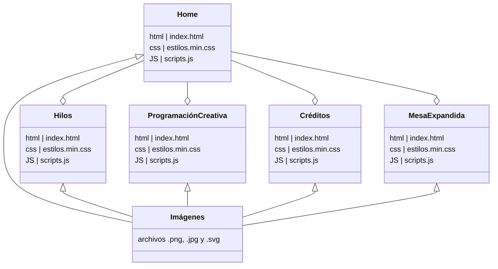

# Tipo, lito, calavera | Tally


Administrador de contenido para el proyecto Tipo, lito, :skull:

_el código del sitio web está [aquí](https://github.com/enflujo/enflujo-tipo-lito-calavera)_

Creado con la versión open-source de [Directus](https://directus.io/).

Este repositorio solamente tiene los archivos de configuración para crear una instancia de Directus con una base de datos vacía. Acá no se van a exponer los datos ni la configuración de las colecciones del CMS. En ese sentido, es un esqueleto que sirve para crear cualquier proyecto similar desde cero.

## Instalación

Se debe instalar [Docker](https://docs.docker.com/) en el servidor o computador local. Seguir las instrucciones del enlace para instalarlo en su equipo según el sistema operativo.

### Definir variables

Primero se debe crear un archivo `.env` en la ruta principal (Se puede copiar y pegar el archivo `.env.ejemplo` y cambiarle el nombre a `.env`).

Con Docker instalado y el `.env` creado, iniciar contenedores con el siguiente comando:

```bash
# Si prefiere ver los logs para revisar si hay errores, quitar el -d del final.
docker compose up -d
```

¡Listo! puede entrar al CMS desde [http://localhost:8055](http://localhost:8055)

El email y contraseña son los que puso en el archivo `.env`. Por ejemplo, si los dejo tal cual en el ejemplo sería:

_Email_: **admin@ejemplo.com**  
_Password_: **clave**

### Notas para usuarios en Linux

Luego de correr los contenedores, Docker crea la carpeta `/uploads` pero en Linux no tiene permisos para crear archivos allí. El siguiente comando corrige los permisos.

Primero apagar los contenedores:

```bash
docker compose down
```

Corregir permisos de la carpeta:

```bash
sudo chown -R 1000:1000 uploads
```

Volver a iniciar contenedores:

```bash
docker compose up
```

## Extensiones

Hay todo tipo de extensiones por acá en Github para instalar en Directus. Este es un ejemplo para instalar una extensión que nos gusta para crear _slugs_ ya que Directus no tiene esta opción de forma predeterminada.

Con la extensión instalada en el `package.json`, se puede correr el siguiente comando para pasarla a Directus:

```bash
yarn extensiones
```

Esto básicamente copia la extensión desde la carpeta `node_modules` donde esta instalada con NPM y la pasa a la carpeta `/extensions`. Directus revisa los archivos en la carpeta `/extensions` al iniciar los contenedores y las carga en la interfaz.

## Diagrama de la estructura del sitio web



- tipo-lito-calavera/
  - imagenes/
  - index.html (home)
  - estilos.scss (documentada)
  - estilos.min.css (pública)
    - hilo1/
      - index.html
      - estilos.scss (documentada)
      - estilos.min.css (pública)
      - scripts.js (documentada)
      - scripts.min.js (pública)
    - hilo2
      - Se repite la misma estructura en todos los hilos, referirse a "hilo1"
  - creditos/
    - index.html
  - programacion-creativa/
    - index.thml (introdución y galería de ejercicios)
    - ejercicio1/
      - index.html
      - estilos.scss (documentada)
      - estilos.min.css (pública)
      - scripts.js (documentada)
      - scripts.min.js (pública)
  - mesa-expandida/
    - index.html
    - estilos.scss (documentada)
    - estilos.min.css (pública)
    - scripts.js (documentada)
    - scripts.min.js (pública)
